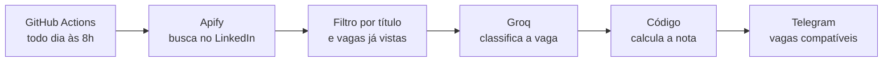

# Robô de vagas do LinkedIn


Robô que, todo dia de manhã, busca vagas novas no LinkedIn, descarta as que não combinam com o meu perfil, pede a uma IA uma análise de compatibilidade e me avisa no Telegram só das melhores. Roda sozinho no GitHub Actions, sem servidor e com custo próximo de zero.

> Projeto de uso pessoal. Ele **não** se candidata a nada nem escreve para recrutadores: só me avisa.

## O que ele faz

1. **Busca** vagas das últimas 24 horas no LinkedIn (duas buscas configuráveis) por meio da Apify.
2. **Filtra** por palavras no título e remove vagas repetidas.
3. **Ignora** vagas que já avaliou em dias anteriores.
4. **Avalia** cada vaga nova com uma IA (Groq): ela classifica senioridade, localização e aderência da stack; **o código calcula a nota** de 0 a 100.
5. **Avisa** no Telegram as vagas com nota acima do mínimo, com resumo, pontos fortes, o que falta e o link.



### Exemplo de mensagem (dados fictícios)

```
🆕 Nova vaga compatível: 60/100

Desenvolvedor Back-end Júnior | Remoto
🏢 Empresa Exemplo
📍 Brazil
📅 Publicada em 29/09/2026
📊 stack média, nível júnior, local compatível

📝 Resumo
Vaga remota de back-end júnior, com foco em APIs REST e bancos relacionais.

✅ Pontos fortes
• Python e FastAPI
• PostgreSQL

⚠️ O que falta
• Experiência com Docker

🔗 https://www.linkedin.com/jobs/view/...

(Análise feita por IA: confira antes de se candidatar.)
```

## Como usar

Você precisa de contas gratuitas na **Apify**, na **Groq** e de um **bot do Telegram** (veja os detalhes na [documentação](docs/DOCUMENTACAO.md#7-como-rodar)).

```bash
git clone https://github.com/laisbrme/robo-vagas-linkedin.git
cd robo-vagas-linkedin
python -m venv .venv
.venv\Scripts\activate          # Linux/Mac: source .venv/bin/activate
pip install -r requirements.txt
```

1. Crie um arquivo `.env` com `APIFY_TOKEN`, `GROQ_API_KEY`, `TELEGRAM_BOT_TOKEN` e `TELEGRAM_CHAT_ID`.
2. Copie `perfil.example.md` para `perfil.md` e preencha com o **seu** perfil (esse arquivo é ignorado pelo Git).
3. Ajuste as buscas, as listas de palavras e a nota mínima em `config.py`.
4. Rode:

```bash
python main.py
```

Para rodar todo dia na nuvem, cadastre os quatro segredos acima mais o `PERFIL_MD` (com o conteúdo do seu `perfil.md`) em *Settings > Secrets and variables > Actions*. O workflow em `.github/workflows/robo-vagas.yml` faz o resto.

## Documentação

Todas as decisões, o passo a passo e as lições aprendidas estão em **[docs/DOCUMENTACAO.md](docs/DOCUMENTACAO.md)**. Alguns destaques:

- Por que a nota é calculada por código e não pela IA;
- Por que o robô **não** gera cartas de apresentação automáticas;
- Como o plano gratuito da IA e da Apify foi respeitado;
- Segurança e privacidade (o perfil pessoal fica fora do repositório).

## Custo

Cerca de US$ 0,04 por execução na Apify (pouco mais de US$ 1 por mês); Groq, Telegram e GitHub Actions em planos gratuitos. Valores vistos em setembro de 2026, confira nos serviços.

## Avisos

- O projeto depende de um scraper de terceiros (Apify) que lê listagens públicas do LinkedIn e pode parar de funcionar se o site mudar. Quem for reutilizar deve verificar os termos de uso das plataformas.
- A análise da IA é um apoio de triagem, não uma verdade sobre o currículo de ninguém.

## Créditos

A ideia e o desenho inicial do fluxo vieram de um [vídeo da Rafaella Ballerini](https://www.youtube.com/watch?v=sq8ThaXkp7k), que o implementa no n8n. Esta versão é uma reescrita em Python, com hospedagem gratuita no GitHub Actions, filtros próprios, nota calculada por regras e controle de vagas já vistas.

## Licença

[MIT](LICENSE)