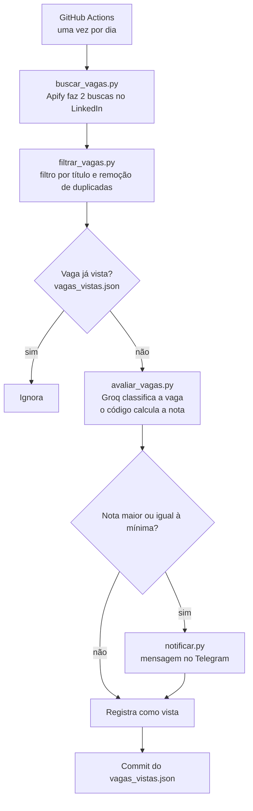

# Documentação do projeto: Robô de vagas do LinkedIn

Robô que, todo dia de manhã, busca vagas novas no LinkedIn, descarta as que não combinam com o meu perfil, pede a uma IA uma análise de compatibilidade e me avisa no Telegram só das melhores. Roda sozinho no GitHub Actions, sem servidor e sem custo fixo.

Este documento explica **o que foi feito, como funciona e por que as decisões foram tomadas**.

## Sumário

1. [O problema e a solução](#1-o-problema-e-a-solução)
2. [Como funciona](#2-como-funciona)
3. [Estrutura do repositório](#3-estrutura-do-repositório)
4. [Decisões técnicas](#4-decisões-técnicas)
5. [Lições aprendidas com a IA](#5-lições-aprendidas-com-a-ia)
6. [Configuração](#6-configuração)
7. [Como rodar](#7-como-rodar)
8. [Automação com GitHub Actions](#8-automação-com-github-actions)
9. [Custos e limites](#9-custos-e-limites)
10. [Segurança e privacidade](#10-segurança-e-privacidade)
11. [Limitações e avisos](#11-limitações-e-avisos)
12. [Próximos passos](#12-próximos-passos)
13. [Créditos](#13-créditos)

---

## 1. O problema e a solução

Procurar emprego no LinkedIn toma horas por dia: muitas vagas parecem relevantes pelo título, mas pedem anos de experiência, outra stack ou outra cidade. A ideia do projeto é usar automação e IA do lado de quem procura: filtrar as vagas e entregar só as que valem a leitura.

**O que o robô entrega por dia:** uma mensagem no Telegram para cada vaga compatível, com nota de 0 a 100, o motivo da nota, um resumo, pontos fortes, requisitos que faltam e o link. No fim de cada execução, uma mensagem-resumo informa quantas vagas foram encontradas e enviadas (assim sei que o robô rodou, mesmo em dia sem vaga boa).

**O que o robô não faz:** não se candidata a nada e não escreve para recrutadores. Tudo vai apenas para o meu chat privado.

## 2. Como funciona



**Passo a passo de uma execução:**

1. **Busca.** O actor `curious_coder/linkedin-jobs-scraper`, da Apify, recebe duas URLs de busca do LinkedIn (já com filtros de nível, cargo e "últimas 24 horas") e devolve até 10 vagas de cada:
   - a região de Porto Alegre, aceitando presencial e híbrido;
   - o Brasil todo, somente vagas remotas.
2. **Filtro por título.** Duas listas de palavras: a vaga só passa se o título tiver ao menos uma palavra da lista "deve ter" e nenhuma da lista "não pode ter" (por exemplo, pleno, sênior, tecnologias que não quero). A comparação ignora maiúsculas e acentos e trata siglas curtas como palavras inteiras. Também remove vagas repetidas entre as duas buscas e limpa o link.
3. **Vagas já vistas.** O arquivo `vagas_vistas.json` guarda o ID de toda vaga já avaliada. Vagas repetidas de um dia para o outro não são reavaliadas nem reenviadas, o que também economiza a IA.
4. **Avaliação com IA.** Para cada vaga nova, a Groq recebe o perfil (`perfil.md`) e a descrição da vaga e responde em JSON com **classificações objetivas** (senioridade, localização, aderência de stack, tecnologia indesejada) e textos (resumo, pontos fortes, requisitos faltantes, observações). **A nota é calculada pelo código**, e não pela IA (veja a seção 4).
5. **Corte.** Vagas com nota abaixo de `NOTA_MINIMA` são descartadas.
6. **Envio.** As vagas que passam viram mensagens de texto no Telegram, da maior para a menor nota.
7. **Persistência.** O GitHub Actions faz commit do `vagas_vistas.json` atualizado para o robô lembrar das vagas no dia seguinte.

**Como a nota é calculada** (`calcular_score` em `avaliar_vagas.py`):

| Critério | Valores | Efeito na nota |
|---|---|---|
| Aderência da stack | alta / média / baixa | parte de 85 / 60 / 30 |
| Senioridade | júnior / incerta / acima | 0 / −10 / −40 |
| Localização | ok / incompatível | 0 / −50 |
| Tecnologia indesejada | sim | −30 |

O resultado é limitado entre 0 e 100. Uma vaga júnior, de stack média e local compatível, por exemplo, fica com 60.

## 3. Estrutura do repositório

| Arquivo | Função |
|---|---|
| `main.py` | Orquestra o fluxo completo e avisa no Telegram se algo falhar. |
| `buscar_vagas.py` | Chama a Apify e devolve as vagas brutas. |
| `filtrar_vagas.py` | Filtro por título, remoção de duplicadas e limpeza do link. |
| `avaliar_vagas.py` | Chama a Groq, interpreta a resposta e calcula a nota. |
| `notificar.py` | Monta e envia as mensagens do Telegram. |
| `config.py` | Buscas, listas de palavras, modelo de IA e nota mínima. Nenhum segredo. |
| `perfil.md` | Perfil usado pela IA para avaliar as vagas. **Fica só na máquina local (ignorado pelo Git)**; no GitHub Actions é criado a partir do Secret `PERFIL_MD`. |
| `perfil.example.md` | Modelo do perfil, com dados fictícios, para quem quiser montar o seu. |
| `vagas_vistas.json` | Registro de vagas já avaliadas (ID, nota, data). |
| `requirements.txt` | Dependências: `requests` e `python-dotenv`. |
| `.github/workflows/robo-vagas.yml` | Agendamento diário no GitHub Actions. |

Arquivos locais ignorados pelo Git: `.env` (chaves), `perfil.md` (perfil pessoal), `vagas_teste.json` e `avaliacoes_teste.json` (caches usados ao rodar `filtrar_vagas.py` e `avaliar_vagas.py` isoladamente, para testar sem gastar API).

## 4. Decisões técnicas

**GitHub Actions em vez de n8n com servidor.** A ideia original (um vídeo de tutorial) usava o n8n hospedado num servidor pago. Como o objetivo era custo zero, o fluxo foi reescrito em Python e agendado no GitHub Actions: não há servidor para manter, o código fica versionado e a execução diária é gratuita.

**Scraper de terceiros (Apify).** Em vez de escrever e manter um scraper do LinkedIn, o projeto usa um actor pronto da Apify, que cobra por resultado. O número de vagas por busca é limitado para manter o custo em centavos por dia.

**Buscas com URLs copiadas do próprio LinkedIn.** Montar os filtros no site e copiar a URL resultou em buscas mais precisas (local, nível, cargo, "últimas 24 horas") do que passar só palavras-chave ao actor.

**Filtro por título antes da IA.** É barato e determinístico: elimina de graça boa parte do ruído e reduz o uso da IA, que tem limites por minuto no plano gratuito.

**IA classifica, código calcula a nota.** A primeira versão pedia à IA uma nota de 0 a 100. Testando a mesma vaga várias vezes, a nota variou muito (de 65 a 35 sem mudar nada). Pedir ao modelo um número "de cabeça" é instável. A solução foi pedir apenas classificações objetivas (por exemplo, "a vaga é júnior, incerta ou acima disso?") e deixar o código transformar isso em nota com regras fixas. A nota passou a ser explicável e muito mais estável.

**Registro de vagas já vistas salvo no próprio repositório.** O executor do GitHub Actions é descartado ao fim de cada execução, então o estado precisa ser guardado em algum lugar. Um JSON pequeno, commitado pelo próprio workflow, é a solução mais simples e sem serviços extras.

**Tratamento de limites da IA gratuita.** O plano gratuito da Groq limita requisições e tokens por minuto. O código espera alguns segundos entre as chamadas e, se receber o erro de limite, aguarda o tempo informado pela API e tenta de novo.

**Nenhum segredo em logs ou mensagens de erro.** O token da Apify e da Groq vão em cabeçalhos HTTP, e não na URL. Para o Telegram (cuja API exige o token na URL), o código captura os erros de rede e mostra uma mensagem genérica, para o token nunca aparecer em saída de erro.

## 5. Lições aprendidas com a IA

- **Modelos de linguagem "enfeitam" quando escrevem sobre uma pessoa.** Uma versão do projeto gerava um rascunho de carta de apresentação para cada vaga. Mesmo com o perfil completo e instruções cada vez mais rígidas (usar só fatos do perfil, não inventar tecnologias, não generalizar), o modelo continuou misturando tecnologias de projetos diferentes e citando ferramentas que não estavam no perfil. A funcionalidade foi **removida**. Conclusão: afirmações sobre a experiência de alguém não devem ser geradas automaticamente sem revisão humana.
- **Os "pontos fortes" gerados pela IA também são texto de IA.** Por isso cada mensagem termina com um aviso para conferir antes de se candidatar.
- **A disponibilidade de modelos muda.** O modelo inicialmente planejado não estava disponível na conta. O nome do modelo fica em `config.py` e a lista de modelos disponíveis pode ser consultada pela API da Groq.
- **Testar a estabilidade, e não só uma resposta.** Rodar a mesma entrada várias vezes revelou problemas (nota instável, detalhes inventados) que uma única execução esconderia.
- **Um filtro por título é grosseiro.** Numa das primeiras execuções, o filtro descartou uma vaga de dados muito compatível só porque o título não tinha a palavra esperada. As listas de palavras são ajustáveis justamente por isso.

## 6. Configuração

Todos os parâmetros ajustáveis estão em `config.py`:

| Parâmetro | O que faz |
|---|---|
| `SEARCH_URLS` | URLs de busca do LinkedIn (uma por linha de interesse). |
| `LIMIT_PER_SOURCE` | Máximo de vagas por URL, o que controla o custo na Apify. |
| `TITULO_DEVE_TER` | O título precisa ter ao menos uma destas palavras. |
| `TITULO_NAO_PODE_TER` | O título é descartado se tiver qualquer uma destas. |
| `MODELO_GROQ` | Modelo de IA usado na avaliação. |
| `MAX_CARACTERES_DESCRICAO` | Quanto da descrição da vaga é enviado à IA. |
| `PAUSA_ENTRE_CHAMADAS` | Espera, em segundos, entre uma avaliação e outra. |
| `NOTA_MINIMA` | Nota mínima (0 a 100) para a vaga ir ao Telegram. |

O arquivo `perfil.md` (local; o repositório traz o modelo `perfil.example.md`) descreve o perfil da candidata (formação, tecnologias, projetos, preferências de vaga). Quanto mais concreto e verdadeiro, melhor a avaliação. Tudo o que está ali é tratado pela IA como fato.

## 7. Como rodar

### Serviços necessários (todos com plano gratuito)

1. **Bot do Telegram:** crie com o `@BotFather` e guarde o token. Envie uma mensagem ao bot e descubra o seu *chat ID* em `https://api.telegram.org/bot<TOKEN>/getUpdates`.
2. **Groq:** crie uma conta e uma chave de API.
3. **Apify:** crie uma conta e copie o token da API.

### Variáveis de ambiente

| Variável | Conteúdo |
|---|---|
| `TELEGRAM_BOT_TOKEN` | Token do bot |
| `TELEGRAM_CHAT_ID` | ID do chat que recebe as mensagens |
| `GROQ_API_KEY` | Chave da Groq |
| `APIFY_TOKEN` | Token da Apify |
| `PERFIL_MD` | Só no GitHub Actions: conteúdo completo do seu `perfil.md` |

### Localmente

```bash
git clone <url-do-repositorio>
cd robo-vagas-linkedin
python -m venv .venv
.venv\Scripts\activate          # Linux/Mac: source .venv/bin/activate
pip install -r requirements.txt
```

Crie um arquivo `.env` (já ignorado pelo Git) com as quatro variáveis acima, copie o `perfil.example.md` para `perfil.md` (também ignorado pelo Git) e preencha com o seu perfil, e ajuste o `config.py`. Depois:

```bash
python main.py
```

Cada etapa também roda isolada, útil para testar e ajustar:

```bash
python buscar_vagas.py     # só a busca na Apify
python filtrar_vagas.py    # busca uma vez, guarda em cache e mostra aprovadas e descartadas
python avaliar_vagas.py    # avalia (com cache) e mostra as notas e os motivos
python notificar.py        # envia ao Telegram as vagas do cache de avaliações
```

Para refazer a busca ou a avaliação do zero, apague `vagas_teste.json` ou `avaliacoes_teste.json`.

## 8. Automação com GitHub Actions

O workflow `.github/workflows/robo-vagas.yml`:

- roda todo dia e também pode ser disparado na mão (botão *Run workflow*);
- instala Python 3.12 e as dependências;
- cria o `perfil.md` a partir do Secret `PERFIL_MD` (o perfil real nunca fica no repositório);
- executa `python main.py` com as chaves vindas dos **Secrets** do repositório;
- ao final, faz commit do `vagas_vistas.json` se ele mudou;
- usa um grupo de concorrência para nunca haver duas execuções ao mesmo tempo.

Para configurar, cadastre os cinco segredos em *Settings > Secrets and variables > Actions*: as quatro chaves e o `PERFIL_MD` (com o conteúdo completo do seu `perfil.md`), todos com os mesmos nomes da tabela da seção 7.

Como o robô faz commits no repositório, rode `git pull` antes de enviar alterações feitas localmente.

## 9. Custos e limites

Valores vistos durante a construção (setembro de 2026); podem mudar, confira nos serviços.

| Serviço | Uso | Custo |
|---|---|---|
| Apify | 2 buscas × 10 vagas por dia, cobrança por resultado | cerca de US$ 0,04 por execução, pouco mais de US$ 1 por mês, dentro dos US$ 5 de crédito gratuito mensal do plano Free |
| Groq | Uma chamada por vaga nova que passa no filtro; poucos milhares de tokens cada | Plano gratuito, dentro dos limites por minuto e por dia |
| GitHub Actions | Cerca de 3 a 6 minutos por execução | Dentro da cota gratuita mensal |
| Telegram | Mensagens do bot | Gratuito |

O limite de resultados por busca (`LIMIT_PER_SOURCE`) é o que mantém o custo da Apify baixo: sem ele, uma busca sem limite pode trazer centenas de vagas por execução.

## 10. Segurança e privacidade

- Chaves e tokens ficam em `.env` (local, ignorado pelo Git) e nos Secrets do GitHub. Nunca no código.
- Os tokens não são passados em URLs (exceto o do Telegram, exigido pela API dele) e as mensagens de erro foram tratadas para não expô-los.
- O `perfil.md` contém dados pessoais e é enviado à Groq a cada avaliação. Não inclua nele telefone, endereço, documentos ou qualquer dado que você não colocaria num currículo público.
- **O perfil real não fica no repositório.** O `perfil.md` é ignorado pelo Git e chega ao GitHub Actions pelo Secret `PERFIL_MD`; o repositório traz apenas o `perfil.example.md`, com dados fictícios.
- O `vagas_vistas.json` guarda apenas ID, nota e data. Como os logs do GitHub Actions de um repositório público são públicos, o robô mostra neles só o ID da vaga, e não o título nem a empresa.

## 11. Limitações e avisos

- **Dependência de um scraper de terceiros.** O robô lê listagens públicas do LinkedIn por meio de um actor da Apify. Ele pode parar de funcionar se o LinkedIn mudar o site ou se o actor for alterado ou removido. É um projeto de uso pessoal; quem for reutilizá-lo deve verificar os termos de uso das plataformas envolvidas.
- **O filtro por título é grosseiro.** Pode descartar vagas boas com títulos incomuns e deixar passar vagas ruins com título bom (nesse caso, a IA costuma cortar na etapa seguinte).
- **A análise da IA não é verdade absoluta.** As classificações e os textos podem errar. A nota é um indicador aproximado, útil para triagem.
- **Só vagas das últimas 24 horas e até 10 por busca.** O robô não varre o histórico de vagas.
- **Sem testes automatizados por enquanto.**

## 12. Próximos passos

- Testes automatizados para as funções puras (`filtrar_vagas`, `calcular_score`, formatação das mensagens).
- Ajustar listas de palavras e nota mínima com base nas vagas recebidas nas primeiras semanas.
- Limpeza periódica de entradas antigas do `vagas_vistas.json`.
- Comparar modelos de IA (qualidade da classificação e estabilidade).

## 13. Créditos

A ideia e o desenho inicial do fluxo (buscar vagas, filtrar, analisar com IA e avisar no Telegram) vieram de um vídeo de Rafaella Ballerini, que o implementa no n8n. Esta versão é uma reescrita em Python, com hospedagem gratuita no GitHub Actions, filtros próprios, nota calculada por regras e controle de vagas já vistas.